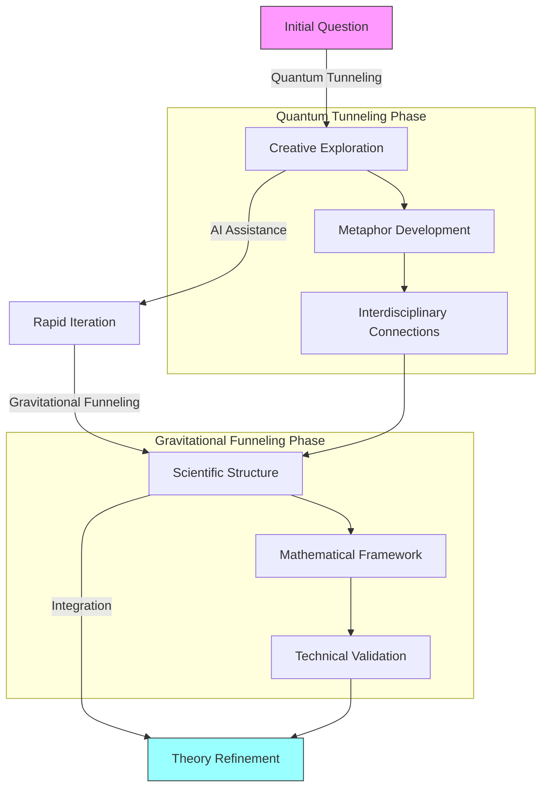

# Quantum Duality Theory (QDT)

A theoretical framework exploring the intersection of quantum mechanics and gravitational effects through a novel dual-scale approach.

## Overview

Quantum Duality Theory (QDT) proposes a unified approach to understanding quantum-gravitational interactions through the lens of scale-dependent behavior and time-mediated transitions. The theory introduces novel mathematical constructs to bridge the gap between quantum and classical regimes.

## Theory Development Process

## Core Components

### 1. Time Mediation Function κ(t)
- Exhibits prime-modulated oscillations
- Features exponential damping envelope
- Controls temporal evolution of quantum-classical transitions

### 2. Scale Coupling Parameter λ(t)
- Defines transition between quantum (λ=0) and classical (λ=1) regimes
- Identifies critical transition point t_c
- Facilitates smooth scale transitions

### 3. Energy Flow Phase Space
- Maps interaction between quantum tunneling (T_q) and gravitational funneling (F_g)
- Demonstrates dynamic equilibrium between scales
- Preserves conservation principles

### 4. Conservation Laws
- Maintains total energy conservation within numerical bounds
- Accounts for local fluctuations while preserving global invariants
- Provides mathematical consistency checks

## Key Features

- **Scale-Dependent Behavior**: Seamless transition between quantum and classical regimes
- **Time-Mediated Evolution**: Dynamic adaptation of system parameters
- **Conservation Principles**: Rigorous mathematical framework ensuring energy conservation
- **Interdisciplinary Integration**: Combines concepts from quantum mechanics, gravity, and complex systems

## Applications

1. **Quantum Computing**
   - Enhanced understanding of decoherence
   - Novel approaches to quantum state manipulation
   - Improved error correction strategies

2. **Cosmology**
   - Early universe dynamics
   - Black hole information paradox
   - Quantum gravity implications

3. **Complex Systems**
   - Multi-scale phenomena modeling
   - Emergence of classical behavior
   - System-environment interactions

## Development Methodology

The theory development follows a structured approach:

1. **Quantum Tunneling Phase**
   - Creative exploration of concepts
   - Development of key metaphors
   - Establishment of interdisciplinary connections

2. **Gravitational Funneling Phase**
   - Mathematical framework construction
   - Technical validation
   - Integration of theoretical components
  
3. Explore the **simulations/** folder for hands-on models and examples.

4. Check out **docs/** for a deep dive into the core concepts and applications.

## Contributing

We welcome contributions from researchers in:
- Quantum Mechanics
- General Relativity
- Complex Systems Theory
- Mathematical Physics
- Computational Physics

## Contact:
For inquiries, reach out to (https://x.com/beanapologist).

## License

This project is licensed under the MIT License - see the [LICENSE](LICENSE) file for details.

---

*Note: This theory is under active development. Contributions and feedback are welcome.*# Quantum-Duality-Theory

